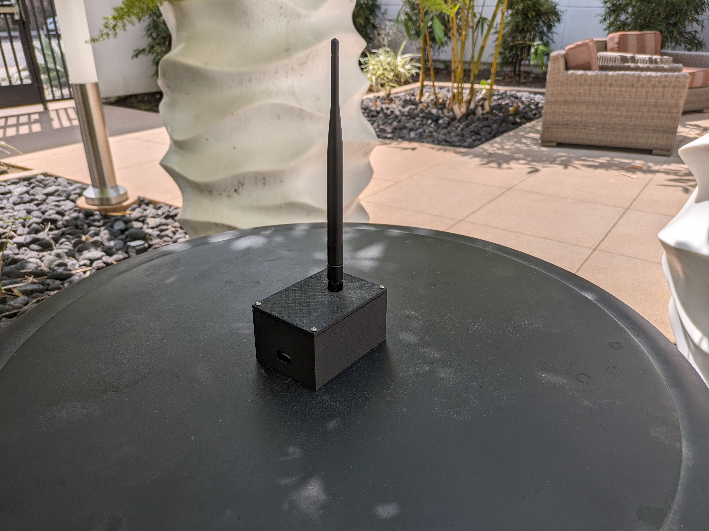

    
       
    <h1 align='bottom'>&nbsp;&nbsp;FAURO: Flight Software</h1>

## Section 1: Project Overview

Welcome to FAURO! This repository houses the Flight Software source code for an avionics platform that has a small form factor and can fit into an amateur rocket kit. While the focus of this project is the Flight Software for the avionics, you will also find source code for ground support equipment, design documentation, and log files from flights. It is a follow-on to the <a href="https://github.com/laboratory10/auro_overview">AURO</a> project. While AURO was implemented in C using a custom-designed FSW architecture, FAURO will be implemented using the  <a href="https://nasa.github.io/fprime/">F' Flight Software Framework</a>

Before going further, I would like to cover my motivation for this project so many of the architecture decisions make more sense. I am interested in developing a system that allows me to challenge and showcase my capabilities as a Flight Software Engineer. While the term Embedded Software Engineer is used more broadly across different industries, I am using the term `Flight Software` (FSW) throughout to signal that the expectation for autonomy and fault tolerance of this code should be on par with design principles used in spaceflight applications.

### Section 1.1: Mission System Architecture
This project is made up of four distinct systems. When referred to all together, the term `Mission System` is used. At an individual system level, there is `FAURO` or the `Flight System`, the `Launch Station`, the `Base Station`, and the `Ground System`. Sometimes, the final three are jointly referred to as the `Ground Segment`.
1. FAURO
    - The flight vehicle and where much of the development effort is focused. The 3D printed Avionics Bay that accompanies FAURO can fit into 76mm diameter rocket kits.
    - The hardware consists of:
        - 3.7v 500mAh Lithium Ion Polymer Battery
        - Flight Computer: ATSAMD21G18 ARM Cortex M0 processor
        - Micro SD storage flight logger
        - 915 MHz radio
        - Accelerometer
        - Magnetometer
        - Gyroscope
        - Altimeter
        - GPS receiver
    - Developed in C++ using the F' Flight Software Framework. While the aforementioned AURO project used the <a href="https://www.freertos.org/index.html">FreeRTOS</a> kernel, the barmetal scheduler needed to be utilized for FAURO due to image size constraints.
      ***The integrated FAURO system***
     &nbsp;&nbsp; 
     
2. The Base Station
    - A device that receives flight data from FAURO and passes it along a serial interface to the ground system
    - The hardware consists of:
        - ATSAMD21G18 ARM Cortex M0 processor
        - 915 MHz radio
    - Developed in C++
      ***The integrated Base Station***
      
     
3. The Ground System
    - For this project, the <a href=https://nasa.github.io/fprime/UsersGuide/gds/gds-introduction.html">F' GDS</a> that ships with F' will be used.
   
4. The Launch Station (/auro/launch_station/)
    - A device that energizes the launch circuit when commanded to ignite the rocket motor
    - Hardware consists of:
        - 3.7v 500mAh Lithium Ion Polymer Battery
        - Flight Computer: ATSAMD21G18 ARM Cortex M0 processor
        - 915 MHz radio
        - Power and safety switches
        - Igniter cables
        - 9V battery
    - Developed in C++
      ***The integrated Launch Station***
      
     

## Section 2: Flight Software Architecture

### Section 2.1: FAURO's FSW Architecture OVerview

### Section 2.2: Board Support Packages, Device Drivers, Libraries, and Includes
In order for everything to work properly, the following board support packages and libraries must be installed:

- Board Support Package:
    - <a href="https://learn.adafruit.com/adafruit-feather-m0-radio-with-lora-radio-module/using-with-arduino-ide">Arduino SAMD Boards</a> by Arduino
    - <a href="https://learn.adafruit.com/adafruit-feather-m0-radio-with-lora-radio-module/using-with-arduino-ide">Adafruit SAMD Boards</a> by Adafruit
- Real Time Operating System:
    - <a href="https://github.com/BriscoeTech/Arduino-FreeRTOS-SAMD21">Arduino-FreeRTOS-SAMD21</a> by BriscoeTech (a port of Richard Barry's FreeRTOS)
- Radio:
    - <a href="https://github.com/adafruit/RadioHead">RadioHead</a> Adafruit Fork
- General Adafruit Sensors:
    - <a href="https://github.com/adafruit/Adafruit_Sensor">Adafruit Unified Sensor</a> by Adafruit
    - <a href="https://github.com/adafruit/Adafruit_BusIO">Adafruit BusIO</a> by Adafruit
- IMU/Gyro and Magnetometer:
    - <a href="https://github.com/adafruit/Adafruit_LIS3MDL">Adafruit_LIS3MDL</a> by Adafruit
    - <a href="https://github.com/adafruit/Adafruit_LSM6DS">Adafruit_LSM6DS</a> by Adafruit
- Barometric Pressure Sensor:
    - <a href="https://github.com/adafruit/Adafruit_BMP3XX">Adafruit_BMP3XX</a> by Adafruit
- GPS Sensor:
    - <a href="https://github.com/adafruit/Adafruit_GPS">Adafruit_GPS</a> by Adafruit

### Section 2.3: FSW Modules and Tasks
TO BE COMPLETED

### Section 2.4: Use of the SPI and I2C Buses
TO BE COMPLETED

### Section 2.5: Telemetry Types
A key set of concepts that is important to understand for this project is how telemetry is organized. In fitting with the objectives of this project, data reported from AURO will look similar to how spacecraft telemetry is structured in industry. Messages sent from AURO to the ground can be one of two types: Event Telemetry (abbreviated to ETL) and Channelized Telemetry (abbreviated to CTL). ETLs can be thought of as a comprehensive system log. In the log, there are a number of entries with a timestamp that note the occurrence of a significant event. This is very similar to the Windows Event Viewer data, to give a parallel to non-spacecraft computing. Also like the Event Viewer, ETLs are each associated with a particular level to describe the type or criticality of the information they contain. At writing, possible ETL levels are RECORD, NOTICE, COMMAND, ALERT, CRITICAL, and LAUNCH. The `enums.h` file has more information about what each level means. In contrast to events, CTLs report specific values of interest at regular intervals that might change over time. An example would be a temperature sensor value. We want to be updated on what the latest readings look like and how it changes over time, but this information isn't necessarily associated with an event.

### Section 2.6: Coding Conventions and Standards
TO BE COMPLETED

While those FAURO-specific conventions are more aesthetic in nature, external standards are also in effect to make the code more reliable and fault tolerant. In 2009, NASA's Jet Propulsion Laboratory published the <a href=https://web.archive.org/web/20111015064908/http://lars-lab.jpl.nasa.gov/JPL_Coding_Standard_C.pdf>JPL Institutional Coding Standard for the C Programming Language</a>. As this standard aligns nicely with the objectives for this project, it was consulted extensively to improve AURO's FSW.

### Section 3: Testing
TO BE COMPLETED

## Section 4: The Ground Segment
The Ground Segment comprises the Base Station, Launch Station, and Ground System.

### Section 4.1: Embedded Base Station and Launch Station Code
TO BE COMPLETED

### Section 4.2: Use of the F' GDS
TO BE COMPLETED

## Section 5: Hardware Integration
### Section 5.1: Purchased Parts List
- AURO
    - <a href="https://www.adafruit.com/product/2796">Adafruit Feather M0 Adalogger</a>
    - <a href="https://www.adafruit.com/product/3229">Adafruit Radio FeatherWing - RFM69HCW 900MHz - RadioFruit</a> (includes male headers)
    - <a href="https://www.adafruit.com/product/1578">Lithium Ion Polymer Battery - 3.7v 500mAh </a>
    - <a href="https://www.adafruit.com/product/4816">Adafruit BMP390 - Precision Barometric Pressure and Altimeter - STEMMA QT / Qwiic</a>
    = <a href="https://www.adafruit.com/product/4565">Adafruit LSM6DSOX + LIS3MDL FeatherWing - Precision 9-DoF IMU</a>
    - <a href="https://www.adafruit.com/product/4415">Adafruit Mini GPS PA1010D - UART and I2C - STEMMA QT</a>
    - <a href="https://www.adafruit.com/product/4399">STEMMA QT / Qwiic JST SH 4-Pin Cable - 50mm Long</a> (2x)
    - <a href="https://www.adafruit.com/product/1661">uFL SMT Antenna Connector</a>
    - <a href="https://www.adafruit.com/product/2830">Stacking Headers for Feather - 12-pin and 16-pin female headers</a>
    - <a href="https://www.adafruit.com/product/2886">Header Kit for Feather - 12-pin and 16-pin Female Header Set</a>
    - <a href="https://www.adafruit.com/product/4269">Simple Spring Antenna - 915MHz</a>
    - <a href="https://www.amazon.com/gp/product/B010Q57SEE/ref=ppx_yo_dt_b_asin_title_o07_s00?ie=UTF8&psc=1">SanDisk Ultra 16GB Ultra Micro SDHC</a>
    - Low voltage wiring for jumpers
- BASE STATION
    - <a href="https://www.adafruit.com/product/3176">Adafruit Feather M0 RFM69HCW Packet Radio - 868 or 915 MHz - RadioFruit</a> (includes male headers)
    - <a href="https://www.amazon.com/gp/product/B095JTW6XM/ref=ppx_yo_dt_b_asin_title_o04_s00?ie=UTF8&psc=1">915MHz LoRa Antenna Omni 5dbi Gain SMA Male</a> (one for Base Station and one for Launch Station)
    - <a href="https://www.adafruit.com/product/1661">uFL SMT Antenna Connector</a>
- LAUNCH STATION
    - <a href="https://www.adafruit.com/product/3076">Adafruit Feather 32u4 RFM69HCW Packet Radio - 868 or 915 MHz - RadioFruit</a>
    - <a href="https://www.adafruit.com/product/2895">Adafruit Non-Latching Mini Relay FeatherWing</a> (includes male headers)
    - <a href="https://www.amazon.com/gp/product/B095JTW6XM/ref=ppx_yo_dt_b_asin_title_o04_s00?ie=UTF8&psc=1">915MHz LoRa Antenna Omni 5dbi Gain SMA Male</a> (one for Base Station and one for Launch Station)
    - <a href="https://www.adafruit.com/product/1661">uFL SMT Antenna Connector</a>
    - <a href="https://www.adafruit.com/product/2886">Header Kit for Feather - 12-pin and 16-pin Female Header Set</a>
    - <a href="https://www.adafruit.com/product/1578">Lithium Ion Polymer Battery - 3.7v 500mAh </a>
    - <a href="https://www.adafruit.com/product/1131">JST-PH Battery Extension Cable - 500mm</a>
    - <a href="https://www.adafruit.com/product/3218">Illuminated Toggle Switch with Cover - Red</a>
    - <a href="https://www.adafruit.com/product/3307">Illuminated Toggle Switch with Cover - Green</a>
    - 9-volt battery
    - Low voltage wiring for jumpers
    - High voltage wiring for launch circuit
### Section 5.2: 3D Printed Parts and Assembly Hardware
- ASSEMBLY HARDWARE
    - <a href="https://www.amazon.com/gp/product/B08LW54QDW/ref=ppx_yo_dt_b_asin_title_o07_s00?ie=UTF8&psc=1">300Pcs Metric M2.5 Stainless Steel Phillips Pan Head Machine Screws Nuts Assortment Kit- M2.5X</a>
    - <a href="https://www.amazon.com/gp/product/B0BK1CD467/ref=ppx_yo_dt_b_asin_title_o07_s02?ie=UTF8&psc=1">YOKIVE 150 Pcs M2.5 Standoff Screws</a>
    - <a href="https://www.amazon.com/gp/product/B07SPWZT5G/ref=ppx_yo_dt_b_asin_title_o06_s00?ie=UTF8&psc=1">100pcs M2.5 Thread Brass Knurled Threaded Insert Embedment Nuts</a>
- 3D PRINTED PARTS (Avionics and Ground Equipment Boxes)
    - see stl files in `/auro/cad_objects/` for:
        - AURO Parts
            - Battery Enclosure
            - Fixed Avionics Bay
            - Removable Avionics Bay
        - Base Station Parts
            - Base Station Base
            - Base Station Top
        - Launch Station Parts
            - Launch Station Base
            - Launch Station Main Top
            - Launch Station Antenna Top

### Section 5.3: AURO Integration
1. Melt embedment nuts into 6 holes on the Fixed Avionics Bay using soldering iron
2. Melt embedment nuts into 2 holes on the side of the Removable Avionics Bay where the Battery Enclosure screws enter
3. Melt embedment nuts into 4 holes on the side of the Removable Avionics Bay where the board mounts
4. Add screw standoffs to the 4 holes where the board mounts
5. Solder a jumper from pin 12 to the reset pin on Adafruit Feather M0 Adalogger
6. Solder jumper from pin 11/A to pin RST on Adafruit Radio FeatherWing
7. Solder jumper from pin 6/D to pin CS on Adafruit Radio FeatherWing
8. Solder jumper from pin 5/E to pin IRQ on Adafruit Radio FeatherWing
9. Solder the spring antenna into the antenna hole on the Adafruit Feather M0 Adalogger
10. Solder Female Header Set to Adafruit Feather M0 Adalogger with black connector on the top side of the board
11. Solder Stacking Header to Adafruit Radio FeatherWing with black connector on the top side of the board
12. Solder Male Header Set to Adafruit LSM6DSOX + LIS3MDL FeatherWing - Precision 9-DoF IMU with the longer portion of the pins on the bottom side of the board
13. Screw the Adafruit Feather M0 Adalogger into the Removable Avionics Bay
14. Insert the stacking header male pin into the Adafruit Feather M0 Adalogger female pins
15. Insert the IMU male pins into the stacking header female pins
16. Add a standoff to two holes that share a long side of the IMU using a nut from the screw kit
17. Screw the GPS antenna into one of the two standoffs on the IMU
18. Screw the BMP sensor into the other standoff on the IMU
19. Use the two STEMMA QT cables to connect the IMU and GPS and the GPS and BMP
20. Thread the battery cable through the opening, place the battery in the appropriate position, and attach the battery enclosure with screws
21. As desired, finish assembly by plugging in the battery, adding the SD card, and connecting the Removable and Fixed Avionics Bays
  ***The integrated AURO system***
 &nbsp;&nbsp; 
 

### Section 5.4: Base Station Integration
1. Melt embedment nuts into the 8 2.5mm holes on the Base Station base using soldering iron
2. Insert four standoff screws on the bottom surface of the inside of the Base Station base
3. Solder uFL SMT connector to appropriate pad on the Adafruit Feather M0 RFM69HCW
4. Mount the Adafruit Feather M0 RFM69HCW board inside the Base Station using the standoffs and M2.5 screws
5. Mount the LoRa Antenna to the hole in the Base Station top
6. Connect the Lora Antenna cable to the uFL connector that was previously soldered
7. Mount the top of the Base Station to the base using M2.5 screws
  ***The integrated Base Station***
 &nbsp;&nbsp; 
 

### Section 5.5: Launch Station Integration
1. Melt embedment nuts into the 9 2.5mm holes on the Launch Station base using soldering iron
2. Insert four standoff screws on the bottom surface of the inside of the Launch Station base
3. Mount the illuminated toggle switches in the two appropriate holes (the larger two) on the Antenna Top
4. Mount the LoRa Antenna to the remaining hole in the antenna top
5. Solder uFL SMT connector to appropriate pad on the Adafruit Feather 32u4 RFM69HCW
6. Solder the Female Header Set to the Adafruit Feather 32u4 RFM69HCW with the black connector portion facing the top of the board
7. Solder the Male Header Set to the Adafruit Non-Latching Mini Relay FeatherWing so that the longer portion of the pin faces the bottom of the board
8. Connect the Adafruit Feather 32u4 RFM69HCW and Adafruit Non-Latching Mini Relay FeatherWing using the pins soldered
9. Cut and splice the JST-PH Battery Extension Cable - 500mm and the Lithium Ion Polymer Battery so that red wire can be run through the green toggle switch
10. Attach the wiring, battery, green switch, and Adafruit Feather 32u4 RFM69HCW such that the board is only powered when the green toggle is flipped up and lighted
11. Wire the 9V battery, red switch, relay, and launch wiring so that the circuit can only completed if the red toggle is flipped up and lighted
12. Solder the jumper wire from pin 12 to the relay set pin
13. Connect launch circuit leads to the appropriate relay outputs
14. Mount the boards to the Launch Station using the standoffs and M2.5 screws
15. Place the Lithium Ion Polymer Battery and 9V battery in the appropriate compartments
16. Mount the top of the Launch Station to the base using M2.5 screws
  ***The integrated Launch Station***
 &nbsp;&nbsp; 
 

## Section 6: To Clone, Compile, and Run This Project
TO BE COMPLETED - procedure for cloning the project properly

## Section 7: To Setup Similar Environment and Project From Scratch
TO BE COMPLETED - procedure for how this project was setup from scratch

## Section 8: Operations
TO BE COMPLETED - procedure for building new image, flashing the image to the target, and launching the GDS